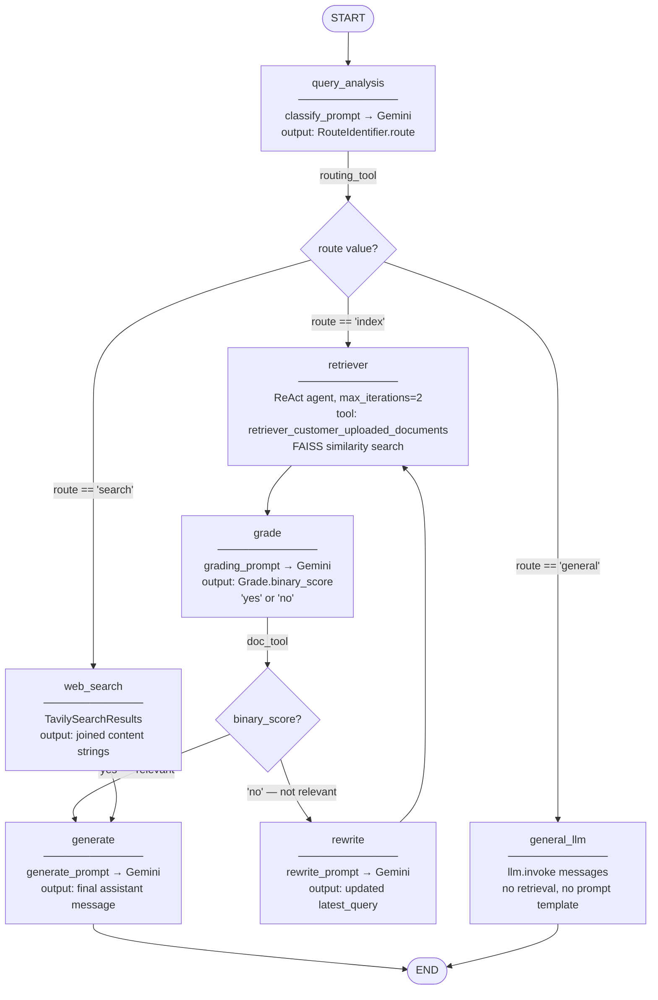

# Adaptive RAG

**A self-routing, self-correcting RAG pipeline built with LangGraph — automatically decides whether to answer from your documents, LLM general knowledge, or live web search, and rewrites the query on low-quality retrieval before giving up.**

[](https://www.python.org/)
[](https://langchain-ai.github.io/langgraph/)
[](https://www.langchain.com/)
[](https://ai.google.dev/)
[](https://faiss.ai/)
[](https://fastapi.tiangolo.com/)
[](https://www.mongodb.com/)
[](https://docs.docker.com/compose/)
[](https://streamlit.io/)
[](LICENSE)

---

## 🌐 Live Demo

**→ [adaptiverag.streamlit.app](https://adaptiverag.streamlit.app/)**

---

## The Problem

Naive RAG retrieves documents and generates an answer regardless of whether retrieved chunks are actually relevant — no mechanism exists to detect retrieval failure, and the system has no fallback when the corpus doesn't cover the question. This produces confident-sounding hallucinations on out-of-distribution queries and silent failures when retrieval quality is poor.

## The Solution

This system adds a graded decision loop around every retrieval: after fetching documents, an LLM grades their relevance as a binary yes/no. A **no** triggers query rewriting and a second retrieval attempt before generating. If the question isn't in the corpus at all, the classifier routes it to Tavily web search or direct LLM general knowledge — before retrieval is even attempted.

---

## ✅ Key Features

- **Up-front query routing** — classifies every query as `index` / `general` / `search` before retrieval, skipping FAISS entirely for general-knowledge or real-time questions
- **LLM-graded retrieval** — `grade` node scores retrieved context with a structured binary output (`yes`/`no`); no heuristics or cosine thresholds
- **Query rewriting on retrieval failure** — `rewrite` node rewrites the original query with a dedicated prompt, then retries retrieval once (ReAct agent `max_iterations=2`)
- **Web search fallback** — `web_search` node calls Tavily API for queries classified as requiring real-time or external knowledge
- **ReAct agent for retrieval** — the `retriever` node runs a LangChain ReAct agent with a named tool (`retriever_customer_uploaded_documents`), not a raw similarity search
- **Per-session conversation memory** — full message history stored in MongoDB per `session_id`, passed to the graph on every request
- **Two-layer auth** — Node.js BFF with Argon2id password hashing, UUID API tokens, HS256 JWT (1hr) — separates auth concerns from the RAG API

---

## 🛠 Tech Stack

### LLM / Orchestration

| Component | Badge | Notes |
|---|---|---|
| LangGraph | [](https://langchain-ai.github.io/langgraph/) | Graph compilation, `StateGraph`, conditional edges |
| LangChain | [](https://www.langchain.com/) | Chains, prompts, ReAct agent, retriever tools |
| Gemini 1.5 Flash | [](https://ai.google.dev/) | All LLM calls — classification, grading, rewriting, generation |
| Tavily | [](https://app.tavily.com) | Real-time web search (`TavilySearchResults`) |

### Vectorstore & Embeddings

| Component | Badge | Notes |
|---|---|---|
| FAISS | [](https://faiss.ai/) | Active vectorstore; in-memory, lost on restart |
| Google Embeddings | [](https://ai.google.dev/) | `GoogleGenerativeAIEmbeddings` — `models/gemini-embedding-001` |
| Qdrant | [](https://qdrant.tech/) | Fully implemented, commented out in `retriever_setup.py` |

### Backend / Frontend / Deployment

| Component | Badge | Notes |
|---|---|---|
| FastAPI | [](https://fastapi.tiangolo.com/) | RAG API — port 8000 |
| Node.js / Express | [](https://nodejs.org/) | Auth BFF — port 8080 |
| MongoDB | [](https://www.mongodb.com/) | Per-session message history via Motor |
| Streamlit | [](https://streamlit.io/) | Chat UI — port 8501 |
| Docker Compose | [](https://docs.docker.com/) | Orchestrates all 4 services |

---

## 🗺 Architecture — The Adaptive Graph

> Every node name and edge below maps 1:1 to `add_node` / `add_conditional_edges` calls in [`src/rag/graph_builder.py`](./Adaptive-Rag/src/rag/graph_builder.py).



**Conditional edge functions** (in [`src/tools/graph_tools.py`](./Adaptive-Rag/src/tools/graph_tools.py)):
- `routing_tool` — reads `state["route"]` → returns `"retriever"`, `"general_llm"`, or `"web_search"`
- `doc_tool` — reads `state["binary_score"]` → returns `"generate"` or `"rewrite"`

> **Note:** A `verify_answer` function exists in `graph_tools.py` (faithfulness check via `VerificationResult`) but is **not registered in the compiled graph** — it is dead code in the current build.

---

## 🔄 How It Works — One Query's Lifecycle

For a query classified as `"index"` (document-grounded):

```
1. POST /rag/query  →  FastAPI loads full MongoDB chat history for session_id

2. query_analysis
   ├─ Calls FAISS retriever to get context snippets
   └─ Sends question + context to Gemini with classify_prompt
      → RouteIdentifier.route = "index"

3. routing_tool  →  next node: "retriever"

4. retriever
   ├─ ReAct agent (max_iterations=2) receives latest_query
   └─ Calls tool: retriever_customer_uploaded_documents
      → FAISS.as_retriever().invoke(query) → top-k chunks

5. grade
   ├─ Sends question + retrieved content to Gemini with grading_prompt
   └─ Grade.binary_score = "yes" | "no"

6a. binary_score == "yes"  →  generate
    └─ Sends retrieved context to Gemini with generate_prompt → final answer → END

6b. binary_score == "no"  →  rewrite
    ├─ Sends original query to Gemini with rewrite_prompt → new query string
    └─ Loops back to retriever (one more attempt, then always proceeds to generate)
```

For `"general"`: skips retrieval entirely → `llm.invoke(messages)` → END

For `"search"`: `TavilySearchResults().invoke(latest_query)` → feeds results to `generate` → END

---

## 🚀 Getting Started

### Prerequisites

- Python 3.11
- Node.js 22+ (for the auth BFF)
- Docker (for MongoDB)
- `GOOGLE_API_KEY` and `TAVILY_API_KEY`

### 1. Clone & Configure

```bash
git clone <your-repo-url>
cd adaptive_rag

cp Adaptive-Rag/.env.example Adaptive-Rag/.env
# Fill in the values below
```

**Required `.env` variables** (in `Adaptive-Rag/`):

| Variable | Required | Where to get it |
|---|---|---|
| `GOOGLE_API_KEY` | ✅ | [aistudio.google.com/app/apikey](https://aistudio.google.com/app/apikey) — Free: 15 RPM, 1500 req/day |
| `TAVILY_API_KEY` | ✅ | [app.tavily.com](https://app.tavily.com) — Free: 1000 searches/month |
| `MONGODB_URI` | ✅ | `mongodb://localhost:27017` for local Docker |
| `QDRANT_URL` | ❌ | Only needed if switching back to Qdrant |

### 2. Option A — Docker Compose (recommended)

```bash
docker compose up --build
```

| Service | Port | URL |
|---|---|---|
| Streamlit UI | 8501 | http://localhost:8501 |
| FastAPI RAG | 8000 | http://localhost:8000/docs |
| Node.js BFF | 8080 | http://localhost:8080 |
| MongoDB | 27017 | internal |

### 2. Option B — Manual (development)

```bash
# Terminal 1 — MongoDB
docker run -d -p 27017:27017 --name mongodb mongo:latest

# Terminal 2 — FastAPI RAG backend
cd Adaptive-Rag
pip install -r requirements.txt
uvicorn src.main:app --reload --host 127.0.0.1 --port 8000

# Terminal 3 — Node.js Auth BFF
cd Agentic-BFF-Node
npm install
node src/index.js

# Terminal 4 — Streamlit frontend
cd Adaptive-Rag
streamlit run streamlit_app/home.py
```

### 3. Ingest Documents

Via the Streamlit sidebar (after login): upload PDF or TXT + description.

Via API directly:
```bash
curl -X POST http://localhost:8000/rag/documents/upload \
  -H "X-Description: Product manual for Model X" \
  -F "file=@/path/to/your/document.pdf"
```

Chunking: `RecursiveCharacterTextSplitter(chunk_size=1000, chunk_overlap=150)`

---

## ⚖️ Trade-offs & Design Decisions

| Decision | Upside | Downside |
|---|---|---|
| **Single LLM (Gemini 1.5 Flash) for all roles** | Consistent context; free tier available | 3–4 sequential calls per query; single API failure point |
| **ReAct agent for retrieval (`max_iterations=2`)** | Agent self-corrects tool call format; intermediate steps logged | Hard 2-iteration cap; overhead vs. direct `.invoke()` |
| **FAISS in-memory vectorstore** | Zero infrastructure setup | All docs lost on Python server restart; no multi-replica support |
| **Binary yes/no grading (no confidence score)** | Cheap, decisive LLM call | Borderline relevance always resolves to rewrite |
| **Rewrite → single retry, not loop** | Bounded latency — max 2 retrieval attempts | Second attempt may also fail; goes to `generate` with bad context |
| **chunk_size=1000, overlap=150** | Fits Gemini's context window per chunk | Many chunks on large docs; precision depends on embedding granularity |
| **JWT token as MongoDB `session_id`** | No separate session table needed | Raw JWT in DB; JWT expiry doesn't purge history |
| **Classifier runs FAISS lookup on every query** | Sees actual retrieved content, not just query text | Extra FAISS call even for `"general"` / `"search"` paths |

---

## 📈 Advantages Over Vanilla RAG

| Vanilla RAG | This System |
|---|---|
| Always retrieves from corpus | Routes to web search or general LLM when corpus is irrelevant |
| Generates from whatever is retrieved | Grades retrieved docs; rewrites query on failure |
| No multi-turn memory | Full per-session history via MongoDB |
| Single fixed pipeline | Three distinct answer paths chosen per query |
| User description used as-is | LLM rewrites the description to a proper retriever tool instruction |

---

## ⚠️ Limitations / Known Issues

| Issue | Detail |
|---|---|
| **FAISS is in-memory** | Documents lost on Python server restart. Qdrant is fully coded in `retriever_setup.py` — just uncomment + set env vars |
| **3–4 LLM calls per query** | On Gemini free tier (15 RPM), high-traffic sessions will hit rate limits quickly |
| **`verify_answer` not wired in** | Faithfulness check (`VerificationResult`) exists in `graph_tools.py` but is not connected to any graph edge |
| **ReAct agent caps at 2 iterations** | Tool call format failures produce partial output with no further retry |
| **API tokens are ephemeral** | Node.js BFF stores tokens in memory — invalidated on BFF restart |
| **Streamlit bypasses BFF for chat** | `/rag/query` is called directly; BFF's `/api/chat` proxy is dead code for the Streamlit UI |
| **No streaming** | Graph runs synchronously — no SSE/token streaming to the frontend |
| **Tavily errors unhandled** | Web search failures propagate as 500s (Gemini 429s are caught and return friendly messages) |

---

## 🗺 Future Roadmap

- [ ] Wire `verify_answer` into the compiled graph as a post-`generate` faithfulness gate before `END`
- [ ] Swap FAISS for Qdrant persistent storage — code is already written, needs env vars + uncomment
- [ ] Add streaming responses via LangGraph `astream_events` + SSE to the Streamlit frontend
- [ ] Add a retry counter field to `State` to cap `rewrite → retriever` cycles and fall through to `web_search`
- [ ] Support multi-document indexing (currently a new upload replaces the existing FAISS store entirely)

---

## 🤝 Contributing

1. Fork the repository
2. Create a feature branch: `git checkout -b feature/your-feature`
3. Commit with clear messages
4. Open a pull request against `main`

Please follow the code style guide in [`CODE_STYLE_GUIDE.md`](./Adaptive-Rag/CODE_STYLE_GUIDE.md).

---

## 📄 License

MIT — see [LICENSE](LICENSE) for details.
